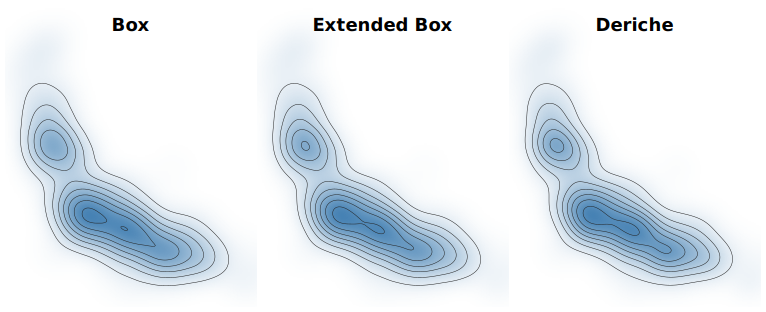

::: teaser { #kde_impulse }

| Gaussian kernel density estimation for a single impulse value ($m$ = 512 bins, $\sigma$ = 0.2). Iterated uniform ("box") filters [@Wells:1986; @Gwosdek:2011] (red & dashed) underestimate the mode and overestimate the sides of the distribution. Deriche's [@Deriche:1990; @Deriche:1993] linear-time recursive filter approximation (blue) produces a pixel-perfect match to the true distribution (grey).
:::

::: abstract
Kernel density estimation (KDE) models a discrete sample of data as a continuous distribution, supporting the construction of visualizations such as violin plots, heatmaps, and contour plots.
This paper draws on the statistics and image processing literature to survey efficient and scalable density estimation techniques for the common case of Gaussian kernel functions.
We evaluate the accuracy and running time of these methods across multiple visualization contexts and find that the combination of linear binning and a recursive filter approximation by Deriche efficiently produces pixel-perfect estimates across a compelling range of kernel bandwidths.
:::

# Introduction

Kernel density estimation (_KDE_) [@Rosenblatt:1956; @Parzen:1962] estimates a continuous probability density function for a finite sample of data.
KDE is regularly used to visualize univariate distributions for exploratory analysis in the form of area charts or violin plots [@Hintzel:1998; @Correll:2014], providing valuable alternatives to histograms.
In two dimensions, KDE estimates produce smoothed heatmaps that can be visualized directly as images or used to extract density isolines [@Lorensen:1987:MCA] for contour plots.

To form a density estimate, each data point is modeled as a probability distribution, or _kernel_, centered at that point.
The kernel is parameterized by a _bandwidth_ $\sigma$ that determines the width (or spread) of each point distribution.
The sum of these kernels constitutes the density estimate for the sample.
While a variety of kernel functions exist, the normal (Gaussian) distribution is a common choice [@Scott:1992], in which case the bandwidth $\sigma$ is its standard deviation.

We would like density estimation to be _fast_: scalable to large datasets, yet amenable to interactive bandwidth adjustment.
A naïve calculation has quadratic $O(m * n)$ complexity: we must sum the contributions of $n$ data points at each of $m$ locations at which we measure the density.
While approximation methods exist, we want them to be _accurate_, as inaccurate estimates can result in visualizations with missing features or false local extrema (peaks or valleys).

This paper reviews scalable, linear-time approximations of Gaussian kernel densities that smooth a binned grid of values.
We evaluate a set of methods -- _box filters_ [@Wand:1994], _extended box filters_ [@Gwosdek:2011], and _Deriche's approximation_ [@Deriche:1990; @Deriche:1993] -- in the context of 1D area charts and 2D heatmaps.
We find that the combination of linear binning (proportionally dividing the weight of a point among adjacent bins) and Deriche's approximation is both fast and highly accurate, outperforming methods currently used in existing visualization tools and often providing pixel-perfect results.

\place{err1d_impulse}

\place{err1d_penguins}

# Density Estimation Methods

Given a dataset with $n$ data points $x_i \in \Re$, a kernel function $K$, and bandwidth $\sigma$, the univariate kernel density estimate is defined as:

~~~ equation
f(x) = \frac{1}{n\sigma} \sum_{i=1}^{n} K{\Big (}\frac{x - x_i}{\sigma}{\Big )}
~~~

We focus on the case where $K$ is the normal (Gaussian) density $K(x) = \frac{1}{\sqrt {2\pi}} e^{-{x^2} / 2}$.
We can directly calculate the density at a point $x$ by summing the kernel response for each data point.
If we query the density at $m$ measurement points, this approach has computational complexity $O(m * n)$, which for large datasets can be untenable.

Nevertheless, direct calculation is used by multiple tools.
At the time of writing, Vega and Vega-Lite [@Satyanarayan:2015; @Satyanarayan:2016] use direct calculation for one-dimensional KDE, where $m$ is the number of points queried in order to draw the density.
Line segments then connect these measured values.
The `kde2d` function of R's MASS [@MASS:2002] package (invoked by the popular ggplot2 [@Wickham:2009] library for 2D density estimates) also uses a direct calculation approach, limiting the feasible number of measurement points for plotting.
One can optimize direct calculation by leveraging spatial indices (e.g., KD trees or Ball trees) to approximate the contribution of suitably distant points [@Gray:2003], as done in the Python scikit-learn library [@ScikitLearn].
However, the asymptotic complexity remains a superlinear function of $n$.

To speed estimation, statisticians proposed _binned KDE_ methods [@Scott:1985] that first aggregate input data into a uniform grid with $m$ bins.
KDE then reduces to the signal processing task of smoothing the binned data.
For example, one can directly convolve the binned values with a discrete Gaussian kernel (or _filter_).
The resulting complexity $O(n + m * w)$ is dependent not just on the number of bins $m$, but also the filter width $w$.
Larger bandwidths can result in filter widths on the same order as $m$, for a quadratic running time.

@Silverman:1982 instead applies the Fast Fourier Transform (FFT), an approach used by R's `density` routine.
A strength of this method is that it can support arbitrary kernel functions: the binned data and a discretized kernel response are separately mapped to the frequency domain using the FFT, the results are multiplied element-wise (convolution in the frequency domain), and an inverse FFT then produces the density estimate.
The complexity is $O(n + m \log m)$, with binning of $n$ points followed by FFT calls on $m$-sized grids.

For even faster estimates, linear-time $O(n + m)$ approximations exist.
These are particularly attractive for 2D density estimation, which can be computed using a series of 1D convolutions along every row and every column of a binned 2D grid.
One can approximate 1D Gaussian convolution by iteratively applying a filter of uniform weight, also known as a **box filter**.
@Wells:1986 applies this method to density estimation, contributing a formula for the filter length $w$ (or equivalently, its radius $r$) as a function of both $\sigma$ and the number of filter iterations $k$.
An attractive property of this approach is its simplicity of calculation: $k$ iterations of uniform filtering (running sums), followed by a scale adjustment.
Both d3-contour [@Bostock:2011] and Vega use per-row and per-column box filters for 2D density estimation.

Box filtering runs in linear-time, but has important nuances.
First, the bandwidth $\sigma$ (a continuous value) is discretized to a filter with integer radius $r$, leading to quantization error.
To address this issue, @Gwosdek:2011 propose an **extended box filter** that introduces some non-uniformity by adding fractional weight to the endpoints of the filter.
Second, the true grid size is no longer a constant parameter such as $m$ = 512 bins.
As iterated filters 'blur' weight into adjacent bins, the grid must be extended on both ends by an offset of $k * r$.
The running time scales as $n + l$, where $l = m + 2k * r$.
As the filter radius $r$ is a monotone function of $\sigma$ [@Wells:1986], this can result in larger grids -- and thus higher time and memory costs -- for larger bandwidths.

Finally, we consider an approximation developed by **Deriche** [@Deriche:1990; @Deriche:1993] for computer vision applications.
Deriche models the right half of the standard Gaussian using an order-$K$ approximation:

~~~ equation
h_{K}(x) = \frac{1}{\sqrt{2 \pi \sigma^2}}
\sum_{k=1}^{K} \alpha_k e^{-x \lambda_k / \sigma}
~~~

From this formulation, Deriche constructs a recursive filter that proceeds linearly from the first value to the last. The left half of the Gaussian is defined by reversing the equation and subtracting the sample at $x = 0$ (so that it is not included twice) to form a second filter. We use a fourth-order approximation ($K = 4$), with coefficients

~~~ equation { nonumber=true }
\alpha_1 & = 0.84 + i 1.8675, \; & \alpha_3 & = -0.34015 - i 0.1299 \\
\lambda_1 & = 1.783 + i 0.6318, \; & \lambda_3  &= 1.723 + i 1.997
~~~

\noindent and $\alpha_{2k} = \alpha_{2k-1}^{*}$, $\lambda_{2k} = \lambda_{2k-1}^{*}$, where $x^*$ denotes the complex conjugate.
Deriche determined the $\alpha_k$ and $\lambda_k$ parameters using numerical optimization to find the $\ell^2$-best fit to the Gaussian over the domain $n = 0, \dots, 1000$ with $\sigma = 100$.
@Getreuer:2013 describes how to algebraically rearrange the terms of these filters into direct summations.

After a constant time initialization to compute summation terms for a chosen $\sigma$, the algorithm requires a linear pass over the $m$ bins for each filter, plus a final pass to sum their results.
To handle boundary values, the algorithm must in general perform iterative initialization per filter, requiring at most another linear pass.
Fortunately, this initialization reduces to a constant time operation for zero-padded data (i.e., where no weight resides outside the bins).^[In contrast to zero-padded data, one must perform iterations for reflected signals (used in image processing to blur without decreasing image brightness) or periodic domains (where the final bin wraps back to the first).]
Deriche's method has complexity $O(n + m)$; it involves more arithmetic operations per step than box filters, but does not require padding the binned grid.
As we will see, it is also much more accurate.
To the best of our knowledge, this work is the first to apply Deriche's approximation to the task of kernel density estimation.

While other methods for approximating Gaussian convolution have been proposed, they exhibit higher error rates and/or longer running times than those above.
For more details, see Getreuer's survey and evaluation in the context of image filtering [@Getreuer:2013].

# Binning Schemes

For binned KDE approaches one must choose how to bin input data into a uniform grid.
By default we assume the weight of a data point is 1; however, a binned grid can easily accommodate variably-weighted points.
**Simple binning**, commonly performed for histograms, places all the weight for a data point into the single bin interval that contains the point.
**Linear binning** [@Jones:1983; @Wand:1994] is an alternative that proportionally distributes the weight of a point between adjacent bins.
If a data point $x_i$ lies between bins with midpoints $b_0$ and $b_1$, linear binning assigns weight proportional to $(b_1 - x_i) / (b_1 - b_0)$ to bin $b_0$ and $(x_i - b_0) / (b_1 - b_0)$ to bin $b_1$.
For example when a point lies at the exact center of a bin, that bin receives all the weight.
If a point resides near the boundary of two bins, its weight is split nearly evenly between them.
We examine both binning approaches in our evaluation below.

# Evaluation

How well do the above estimation methods perform in practice?
@Getreuer:2013 evaluates a suite of Gaussian filtering methods in the context of image processing (e.g., blurring), inspiring the choice of methods we evaluate here.
That survey does not address the question of binning method (images are already discretized into pixels) and assumes reflected signals outside the image boundaries (for filters that preserve overall image brightness).
@Bullman:2018 examine approximate KDE methods for sensor fusion applications.
They do not evaluate visualization directly, and only assess box filter approaches, omitting alternative methods such as Deriche approximation.

We evaluate KDE methods in a visualization context, assessing box filters, extended box filters, and Deriche approximation.
For the box filter methods, we use $k$ = 3 iterations of filtering.
Using 4 or 5 iterations trades-off longer running times for higher accuracy, but the results remain qualitatively similar.
For the Deriche method, we use a 4th-order recursive filter approximation [@Getreuer:2013]. Datasets and benchmark scripts are included as supplemental material.

## Method

We compare the speed and accuracy of KDE methods for both univariate and bivariate visualizations.
To measure accuracy, we compare against a direct calculation approach.
As pixel-based visualizations are inherently discrete, we compute 'ground truth' density estimates at the per-pixel level.
We treat each pixel as a bin and calculate the probability mass it contains, which is the difference in the KDE cumulative distribution function between the ending and starting bin boundaries.
We then compare these values to estimates from approximation methods.
For the approximate methods, we linearly interpolate results across the $m$ bins to produce pixel-level estimates; this matches the standard plotting method of connecting density measurement points with line segments.

To evaluate accuracy in a visualization context, we consider how density plots are presented.
It is common to use a linear scale with a domain that ranges from zero to the maximum density.
To mirror this, prior to comparison we separately scale the density estimates, dividing each by its maximum value.
We then multiply by a factor of 100, so that estimates lie on a [0, 100] scale.
This provides an interpretable measure of error: discrepancies between methods correspond to the number of pixels difference in a 100 pixel-tall chart (a reasonable size for showing distributions, including violin plots), and simultaneously conveys a percentage difference.

We report the maximum ($L_\infty$) error, indicating the most 'glaring' mistake a method makes; root-mean-square error gives qualitatively similar results.
For 1D estimation we compare to ground truth estimates for a 1024 pixel wide chart.
For 2D estimation we compare to ground truth for a 512 $\times$ 512 heatmap.
Both were chosen to align with common resolutions and computation constraints.

Automatic bandwidth selection for kernel density estimation has received a great deal of attention [@Sheather:1991; @Scott:1992].
To contextualize our results, we use Scott's normal reference density (NRD) rule [@Scott:1992], a common default intended to minimize the asymptotic mean integrated squared error (MISE) relative to a normal distribution.

Each method was implemented as a single-threaded routine in JavaScript for web-based visualization.
Benchmarks were run in Node.js v15.12.0 on a 2017 MacBook Pro with a 2.9 GHz Intel Core i7 processor.
We used the `performance.now` method of the `perf_hooks` package to measure running times over repeated runs.

## Results: 1D Estimation

::: figure {#err1d_impulse .page position="t"}

| 1D estimation error for a single impulse. Error (plotted on a log scale) is measured as the maximum pixel error given a 100-pixel plot height. Box filters exhibit an oscillating pattern due to bandwidth quantization; the extended box method smooths these artifacts. Deriche approximation consistently produces lower error, typically with sub-pixel accuracy. Linear binning further reduces the error rate.
\vspace{4pt}
:::

::: figure {#err1d_penguins .page position="t"}

| 1D estimation error for Gentoo penguin body mass. Error (plotted on a log scale) is measured as the maximum pixel error given a 100-pixel plot height. Dashed gray lines indicate the normal reference density (NRD) heuristic for automatic bandwidth ($\sigma$) selection [@Scott:1992]. The combination of linear binning and Deriche approximation consistently produces the most accurate estimates.
:::

We first evaluate the KDE methods relative to an impulse: we locate a single point at $x = 0$ and perform estimation over the domain $[-1, 1]$.
The result should be a Gaussian distribution with mean 0 and standard deviation matching the kernel bandwidth $\sigma$.
@fig:kde_impulse shows the result for $\sigma$ = 0.2 and $m$ = 512 bins (sans re-scaling).
The box filter methods produce perceptible errors, whereas Deriche approximation provides a pixel-perfect match to the actual distribution.

@fig:err1d_impulse presents scaled comparisons by binning scheme, bin count, and bandwidth.
Standard box filters produce oscillating errors due to bandwidth quantization.
The extended box method smooths these artifacts.
Deriche approximation consistently produces the lowest error, and notably improves with the use of linear binning.

::: figure {#kde_penguins .margin .rowspan2 position="t"}

| KDE of Gentoo penguin body mass ($m$ = 512 bins, $\sigma$ = 50). Box filters tend to underestimate peaks and overestimate valleys, in some cases 'eroding' local peaks (e.g., around 4.9k & 5.7k grams). Deriche approximation instead produces a pixel-perfect result.
\vspace{8pt}
:::

We next examine real-world measurements from the Palmer Penguins dataset [@Horst:2020].
We estimate densities for penguin body mass (in grams) for $n$ = 123 Gentoo penguins on the domain $[0, 7000]$.
@fig:err1d_penguins shows maximum estimation errors.
We again see that the combination of Deriche approximation and linear binning produces the best results, often with sub-pixel error.
@fig:kde_penguins shows a subset of the visualized density.
The box filter methods again produce perceptible deviations, which in multiple instances obscure local extrema.
Deriche approximation produces a pixel-perfect result.

To assess scalability, we generate datasets of arbitrary size based on the Gentoo penguins data.
We first fit a kernel density estimate using direct calculation ($\sigma$ = 200, based on the NRD value of 204.11), then sample from the resulting distribution to generate datasets ranging from $n$ = 100 to $n$ = 10M points.
Each timing measurement is taken for $m$ = 512 bins and averages runs for five bandwidths (100, 150, 200, 250, 300) centered near the original NRD value.
@fig:time1d_penguins plots the results.
For small $n$, box filtering is slightly faster as it involves fewer arithmetic operations.
As $n$ increases, the $O(n)$ binning calculation dominates and all methods exhibit similar performance.

::: figure {#time1d_penguins .margin position="t"}

| Running time of 1D estimation on resampled penguin data ($m$ = 512 bins). As $n$ increases, the running time of the approximation methods is dominated by the $O(n)$ binning cost.
:::

\place{err2d_cars}

\place{time2d_cars}

\place{contours}

## Results: 2D Estimation

::: figure {#err2d_cars .page position="t"}

| 2D estimation error for car data. Error (on a log scale) is measured as the maximum pixel error given a 100-pixel plot height. Dashed gray lines indicate the NRD $\sigma$ value. With 512 bins and linear binning, the Deriche method results in sub-pixel accuracy at all sampled bandwidths.
:::

To assess bivariate estimates, we use the classic cars dataset [@CarsData] and examine the relationship between mileage and horsepower.
We use the same error measure.
@fig:err2d_cars presents the error across binning and bandwidth choices (the same bandwidth is used for the x- and y-dimensions), with similar patterns as before.
Deriche approximation with linear binning at $m$ = 512 bins produces notably low error rates.

::: figure {#contours .margin .rowspan4 position="h!"}

\vspace{-30pt}
| Heatmaps and contour plots of car data (miles per gallon vs. horsepower). _Top:_ plots per density method. _Bottom:_ contour lines per method overlaid to facilitate comparison. Deriche's approximation matches the precise density estimate. Box filter methods result in additional and/or missing contour lines and distorted shapes.
:::

@fig:contours shows heatmaps and contour plots for 2D density estimation, both as separate plots and as contours overlaid on a ground truth heatmap.
We set $\sigma$ = 0.04 for both the x- and y-dimensions, near the NRD estimates (0.049, 0.048) for each variable.
The same contour thresholds -- $[0.01, 0.08]$ with increments of 0.01 -- are applied for each method.
Comparison of the contour plots reveals hallucinators [@Kindlmann:2014], where approximation methods produce different visual features for the same underlying data.
The Deriche method provides a pixel-perfect match to the true density, but the box filter methods result in different extrema as well as distorted contour shapes.

As shown earlier (@fig:time1d_penguins), for large datasets the running time of binned KDE methods is dominated by the $O(n)$ binning.
Here we instead assess the effect of bandwidth on 2D estimation time, shown in @fig:time2d_cars.
At low bandwidths, standard box filtering is fastest due to fewer operations per bin.
However, both box filter methods become slower at larger bandwidths due to the need to enlarge the underlying grid.
This overhead is exacerbated for 2D estimation, as the number of expanded cells multiply across grid rows and columns.
In contrast the Deriche method is stable across bandwidths as it does not require grid extensions, with performance matching or exceeding the other methods for bandwidths at or above the NRD bandwidth suggestion.

::: figure {#time2d_cars position="h!"}

| Running time of 2D estimation on car data, by bandwidth. At low bandwidths, Deriche's method is slightly slower due to more arithmetic operations. As the bandwidth increases, the box filters require larger grids, leading to longer running times.
:::

# Conclusion

We survey approaches for KDE, finding that a combination of linear binning and Deriche approximation results in fast, linear-time performance and excellent accuracy at all but the smallest bandwidths.
Though limited to Gaussian kernels only, this approach provides fast and accurate KDE for the tested univariate and bivariate visualizations.
Our implementation and benchmarks, including additional error metrics, are available as open source software (<https://github.com/uwdata/fast-kde>) and we intend to integrate this method into existing web-based visualization libraries.

::: acknowledgments
We thank the UW Interactive Data Lab and anonymous reviewers.
The work was supported by a Moore Foundation software grant.
:::

~~~ bibliography
@article{Rosenblatt:1956,
  author = {Murray Rosenblatt},
  title = {Remarks on Some Nonparametric Estimates of a Density Function},
  volume = {27},
  journal = {The Annals of Mathematical Statistics},
  number = {3},
  publisher = {Institute of Mathematical Statistics},
  pages = {832--837},
  year = {1956},
  doi = {10.1214/aoms/1177728190}
}

@article{Parzen:1962,
  author = {Emanuel Parzen},
  title = {On Estimation of a Probability Density Function and Mode},
  volume = {33},
  journal = {The Annals of Mathematical Statistics},
  number = {3},
  publisher = {Institute of Mathematical Statistics},
  pages = {1065 -- 1076},
  year = {1962},
  doi = {10.1214/aoms/1177704472}
}

@inproceedings{Bullman:2018,
  author = {Bullmann, M. and Fetzer, T. and Ebner, F. and Deinzer, F. and Grzegorzek, M.},
  title = {Fast Kernel Density Estimation Using {G}aussian Filter Approximation},
  year = {2018},
  booktitle = {Proc. International Conference on Information Fusion (FUSION)},
  pages = {1233--1240},
  doi = {10.23919/ICIF.2018.8455686}
}

@article{Deriche:1990,
  author = {Deriche, R.},
  title = {Fast Algorithms for Low-Level Vision},
  journal = {IEEE Transactions on Pattern Analysis and Machine Intelligence},
  volume = {12},
  number = {1},
  year = {1990},
  pages = {78--87},
  doi = {10.1109/34.41386}
}

@techreport{Deriche:1993,
  author = {Deriche, R.},
  title = {Recursively implementing the {G}aussian and its derivatives},
  year = {1993},
  institution = {INRIA},
  url = {http://hal.inria.fr/docs/00/07/47/78/PDF/RR-1893.svg}
}

@misc{CarsData,
  author = {Ernesto Ramos and David Donoho},
  title = {{ASA} Data Exposition Dataset},
  year = {1983},
  howpublished = {\url{http://stat-computing.org/dataexpo/1983.html}}
}

@article{Getreuer:2013,
  author = {Getreuer, P.},
  title = {A Survey of {G}aussian Convolution Algorithms},
  journal = {Image Processing On Line},
  volume = {3},
  year = {2013},
  pages = {286--310},
  doi = {10.5201/ipol.2013.87}
}

@inproceedings{Gwosdek:2011,
  author = {Gwosdek, P. and Grewenig, S. and Bruhn, A. and Weickert, J.},
  title = {Theoretical foundations of {G}aussian convolution by extended box filtering},
  year = {2011},
  booktitle = {Proc. International Conference on Scale Space and Variational Methods in Computer Vision},
  pages = {447--458},
  doi = {10.1007/978-3-642-24785-9_38}
}

@article{Scott:1985,
  author = {Scott, D. W. and Sheather, S. J.},
  title = {Kernel density estimation with binned data},
  journal = {Communications in Statistics - Theory and Methods},
  volume = {14},
  number = {6},
  year = {1985},
  pages = {1353--1359},
  doi = {10.1080/03610928508828980}
}

@article{Sheather:1991,
  author = {Sheather, S. J. and Jones, M. C.},
  title = {A reliable data-based bandwidth selection method for kernel density estimation},
  journal = {Journal of the Royal Statistical Society, Series B (Methodological)},
  volume = {53},
  number = {3},
  year = {1991},
  pages = {683--690},
  doi = {10.1111/j.2517-6161.1991.tb01857.x}
}

@article{Jones:1983,
  author = {Jones, M. C. and Lotwick, H. W.},
  title = {On the errors involved in computing the empirical characteristic function},
  journal = {Journal of Statistical Computation and Simulation},
  volume = {17},
  number = {2},
  year = {1983},
  pages = {133--149},
  doi = {10.1080/00949658308810650}
}

@article{Silverman:1982,
  author = {Silverman, B. W.},
  title = {Algorithm {AS} 176: Kernel density estimation using the fast Fourier transform},
  journal = {Journal of the Royal Statistical Society, Series C (Applied Statistics)},
  volume = {31},
  number = {1},
  pages = {93--99},
  year = {1982},
  doi = {10.2307/2347084}
}

@book{Scott:1992,
  title = {Multivariate Density Estimation: Theory, Practice, and Visualization},
  author = {Scott, David W},
  year = {1992},
  publisher = {John Wiley \& Sons},
  doi = {10.1002/9780470316849}
}

@article{Wand:1994,
  author = {Wand, M. P.},
  title = {Fast Computation of Multivariate Kernel Estimators},
  journal = {Journal of Statistical Computation and Simulation},
  volume = {3},
  number = {4},
  year = {1994},
  pages = {433--445},
  doi = {10.2307/1390904}
}

@article{Wells:1986,
  author = {Wells, W. M.},
  title = {Efficient synthesis of {G}aussian filters by cascaded uniform filters},
  journal = {IEEE Transactions on Pattern Analysis and Machine Intelligence},
  volume = {8},
  number = {2},
  year = {1986},
  pages = {234--239},
  doi = {10.1109/TPAMI.1986.4767776}
}

@inproceedings{Gray:2003,
  title = {Nonparametric density estimation: Toward computational tractability},
  author = {Gray, Alexander G and Moore, Andrew W},
  booktitle = {Proc. 2003 SIAM International Conference on Data Mining},
  pages = {203--211},
  year = {2003},
  doi = {10.1137/1.9781611972733.19}
}

@article{Lorensen:1987:MCA,
  author = {Lorensen, William E. and Cline, Harvey E.},
  title = {Marching Cubes: A High Resolution {3D} Surface Construction Algorithm},
  journal = {SIGGRAPH Computer Graphics},
  volume = {21},
  number = {4},
  month = aug,
  year = {1987},
  pages = {163--169},
  doi = {10.1145/37402.37422}
}

@article{Correll:2014,
  title = {Error Bars Considered Harmful: Exploring Alternate Encodings for Mean and Error},
  author = {Correll, Michael and Gleicher, Michael},
  journal = {IEEE Transactions on Visualization and Computer Graphics},
  volume = {20},
  number = {12},
  pages = {2142--2151},
  year = {2014},
  publisher = {IEEE},
  doi = {10.1109/TVCG.2014.2346298}
}

@article{Hintzel:1998,
  title = {Violin Plots: A Box Plot-Density Trace Synergism},
  author = {Hintze, Jerry L and Nelson, Ray D},
  journal = {The American Statistician},
  volume = {52},
  number = {2},
  pages = {181--184},
  year = {1998},
  publisher = {Taylor \& Francis},
  doi = {10.1080/00031305.1998.10480559}
}

@article{Kindlmann:2014,
  author = {Kindlmann, Gordon and Scheidegger, Carlos},
  journal = {IEEE Transactions on Visualization and Computer Graphics},
  title = {An Algebraic Process for Visualization Design},
  year = {2014},
  volume = {20},
  number = {12},
  pages = {2181--2190},
  doi = {10.1109/TVCG.2014.2346325}
}

@manual{Horst:2020,
  title = {palmerpenguins: Palmer Archipelago (Antarctica) penguin data},
  author = {Allison Marie Horst and Alison Presmanes Hill and Kristen B Gorman},
  year = {2020},
  note = {R package version 0.1.0},
  url = {https://allisonhorst.github.io/palmerpenguins/},
  doi = {10.5281/zenodo.3960218}
}

@article{Bostock:2011,
  title={D3: Data-Driven Documents},
  author={Bostock, Michael and Ogievetsky, Vadim and Heer, Jeffrey},
  journal={IEEE Transactions on Visualization and Computer Graphics},
  volume={17},
  number={12},
  pages={2301--2309},
  year={2011},
  publisher={IEEE},
  doi={10.1109/TVCG.2011.185}
}

@book{Wickham:2009,
  title={ggplot2: Elegant Graphics for Data Analysis},
  author={Wickham, Hadley},
  year={2009},
  publisher={Springer},
  doi={10.1007/978-0-387-98141-3}
}

@article{Satyanarayan:2015,
  title={Reactive {V}ega: A streaming dataflow architecture for declarative interactive visualization},
  author={Satyanarayan, Arvind and Russell, Ryan and Hoffswell, Jane and Heer, Jeffrey},
  journal={IEEE Transactions on Visualization and Computer Graphics},
  volume={22},
  number={1},
  pages={659--668},
  year={2015},
  publisher={IEEE},
  doi={10.1109/TVCG.2015.2467091}
}

@article{Satyanarayan:2016,
  title={Vega-{L}ite: A grammar of interactive graphics},
  author={Satyanarayan, Arvind and Moritz, Dominik and Wongsuphasawat, Kanit and Heer, Jeffrey},
  journal={IEEE Transactions on Visualization and Computer Graphics},
  volume={23},
  number={1},
  pages={341--350},
  year={2016},
  publisher={IEEE},
  doi={10.1109/TVCG.2016.2599030}
}

@book{MASS:2002,
  title={Modern applied statistics with S},
  author={Venables, W. N. and Ripley, B. D.},
  year={2002},
  publisher={Springer},
  doi={10.1007/978-0-387-21706-2}
}

@article{ScikitLearn,
 title={Scikit-learn: Machine Learning in {P}ython},
 author={Pedregosa, F. and Varoquaux, G. and Gramfort, A. and Michel, V.
         and Thirion, B. and Grisel, O. and Blondel, M. and Prettenhofer, P.
         and Weiss, R. and Dubourg, V. and Vanderplas, J. and Passos, A. and
         Cournapeau, D. and Brucher, M. and Perrot, M. and Duchesnay, E.},
 journal={Journal of Machine Learning Research},
 volume={12},
 pages={2825--2830},
 year={2011},
 doi={10.5555/1953048.2078195}
}
~~~
