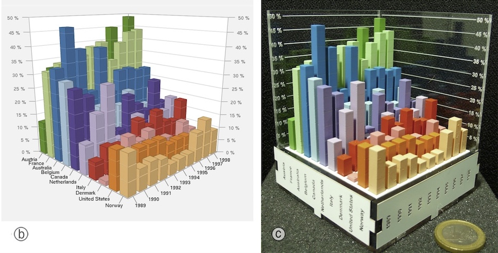
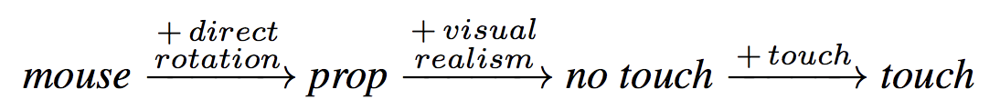

<!--
Replica of the Frequentist example in the Explorable Multiverse Analyses paper.

Link: https://explorablemultiverse.github.io/examples/frequentist/

Source: https://github.com/explorablemultiverse/explorablemultiverse.github.io/blob/master/examples/frequentist/index.html
-->

::: abstract
A previous study has shown that moving 3D data visualizations to the physical world can improve users' efficiency at information retrieval tasks. Here, we re-analyze a subset of the experimental data using a multiverse analysis approach. Results from this multiverse analysis are presented as explorable explanations, and can be interactively explored in this paper. The study’s findings appear to be robust to choices in statistical analysis.
:::

# Introduction

Whereas traditional visualizations map data to pixels or ink, physical visualizations (or "data physicalizations") map data to physical form. While physical visualizations are compelling as an art form, it is unclear whether they can help users carry out actual information visualization tasks.

Five years ago, a study was published comparing physical to on-screen visualizations in their ability to support basic information retrieval tasks [@Jansen2013]. Interactive 2D representations were clearly the fastest, but a gain in speed was observed when transitioning from on-screen to physical 3D representations. Overall, the study suggested that features unique to physical objects – such as their ability to be directly touched – can facilitate information retrieval.

These results however only hold for the particular data analysis that was conducted. A group of statisticians and methodologists recently argued that results from a single analysis can be unreliable [@Steegen2016]. They recommended researchers to conduct instead *multiverse analyses*, i.e., to perform all reasonable analyses of their data and report a summary of their outcomes. While Steegen et al. show how to summarize all outcomes using p-values, here we use an interactive approach based on Bret Victor's concept of *explorable explanation* [@Victor2011].

::: figure {#bar-charts .page position="t"}

| 3D bar chart, on-screen and physical.
:::

# Experiment

The study consisted of two experiments. In the first experiment, participants were presented with 3D bar charts showing country indicator data, and were asked simple questions about the data. The 3D bar charts were presented both on a screen and in physical form (see @fig:bar-charts). The on-screen bar chart could be rotated in all directions with the mouse. Both a regular and a stereoscopic display were tested. An interactive 2D bar chart was also used as a control condition. Accuracy was high across all conditions, but average completion time was lower with physical 3D bar charts than with on-screen 3D bar charts.

Here we only re-analyze the second experiment, whose goal was to better understand why physical visualizations appear to be superior. The experiment involved an "enhanced" version of the on-screen 3D chart and an "impoverished" version of the physical 3D chart. The enhanced on-screen chart was rotated using a 3D-tracked tangible prop instead of a mouse. The impoverished physical chart consisted of the same physical object but participants were instructed not to use their fingers for marking. There were 4 conditions:

- *physical touch*: physical 3D bar charts where touch was explicitly encouraged in the instructions.
- *physical no touch*: same charts as above except subjects were told not to use their fingers to mark points of interest (labels and bars).
- *virtual prop*: on-screen 3D bar charts with a tangible prop for controlling 3D rotation.
- *virtual mouse*: same charts as above, but 3D rotation was mouse-controlled.

These manipulations were meant to answer three questions: *1)* how important is direct touch in the physical condition? *2)* how important is rotation by direct manipulation? *3)* how important is visual realism? Visual realism referred to the higher perceptual richness of physical objects compared to on-screen objects, especially concerning depth cues. Figure 2 summarizes the three effects of interest.

::: figure {#comparisons position="t"}

| Effects of interest.
:::

Sixteen participants were recruited, all of whom saw the four conditions in counterbalanced order. For more details about the experiment, please refer to [@Jansen2013].

# Results

Like the original paper we use an estimation approach, meaning that we report and interpret all results based on (unstandardized) effect sizes and their interval estimates [@Dragicevic2016]. We explain how to translate the results into statistical significance language to provide a point of reference, but we warn the reader against the pitfalls of dichotomous interpretations [@Amrhein2017].

``` js { hide=true }
// Copied from https://github.com/explorablemultiverse/explorablemultiverse.github.io/blob/master/examples/commons/scripts/TangleKit/TangleKit.js#L415-L433
// Pretty-formats probabilities. Works for p-values, alpha values, etc.
function formatProb(value) {
  if (value <= 0.5) {
    // Convert the number into a string with two significant digits
    value = Number.parseFloat(value).toPrecision(2);
    // Remove the trailing zeros, which look weird for standard alpha values like .05
    value = Number.parseFloat(value).toPrecision();
    // Remove leading zero
    value = (value+"").replace(/^0+/, '');
  } else {
    // Work with 1-p if p > 0.5. This retains a high precision for probabilities close to 1.
    value = 1 - formatProb(1 - value); 
    // extra tweak to prevent strange javascript rounding errors
    value = Math.round(value * 100000000) / 100000000;
    // Remove leading zero
    value = (value+"").replace(/^0+/, '');
  }
  return value;
}
```
``` js { hide=true }
function formatPercentage(value) {
  value = formatProb(value / 100) * 100;
  // extra tweak to prevent strange javascript rounding errors
  value = Math.round(value * 100000000) / 100000000;
  return value + "%";
}
```
``` js { hide=true }
bootstrap =  true;
```
``` js { hide=true }
log_transform = true;
```
``` js { hide=true }
bonferroni = true;
```
``` js { hide=true }
n_comparisons = 3;
```
``` js { hide=true }
confidence_level = 50;
```
``` js { hide=true }
file_suffix = `${Math.round(confidence_level * 10) / 1000}${bootstrap ? "-bootstrapped" : ""}${log_transform ? "-log-transformed" : ""}${bonferroni ? "-bonferroni-adjusted" : ""}.jpg`;
```
``` js { hide=true }
fig1 = `R/figures/fig1-${file_suffix}`;
```
``` js { hide=true }
fig2 = `R/figures/fig2-${file_suffix}`;
```
```js { hide=true }
alpha_level = 1 - confidence_level / 100;
```
```js { hide=true }
cite_sauro_lewis = !bootstrap && log_transform;
```
```js { hide=true }
individual_alpha_level = bonferroni ? alpha_level / n_comparisons : alpha_level;
```
```js { hide=true }
individual_confidence_level = bonferroni ? 100 * (1 - individual_alpha_level) : confidence_level;
```
```js { hide=true }
familywise_error_rate = 1 - Math.pow((1-individual_alpha_level), n_comparisons);
```
```js { hide=true }
simultaneous_confidence_level = 100 * (1 - familywise_error_rate);
```

::: figure {#fig1 position="t"}
```js
html``;
```
| Average task completion time `js log_transform ? "(arithmetic mean)" : "(geometric mean)"` for each condition. Error bars are `js formatPercentage(confidence_level)` t-based CIs.
:::

We focus our analysis on task completion times, reported in @fig:fig1 and @fig:fig2. Dots indicate sample means, while error bars are [:tangle-adjustable-option:]{values=[50,68,80,90,95,99,99.9] value="50" display="(x) => x + '%'" span=5 bind=confidence_level} confidence intervals computed on [:tangle-toggle:]{values=["untransformed\ data","log-transformed\ data\ [@Sauro2010]"] bind=log_transform} using the [:tangle-toggle:]{values=["t-distribution","BCa\ bootstrap\ [@Kirby2013]"] bind=bootstrap} method.

Strictly speaking, all we can assert about each interval is that it comes from a procedure designed to capture the population mean `js formatPercentage(confidence_level)` of the time across replications, under some assumptions [@Morey2016]. In practice, if we assume we have very little prior knowledge about population means, each interval can be informally interpreted as a range of plausible values for the population mean, with the midpoint being `js confidence_level === 95 ? "about 7 times" : ""` more likely than the endpoints [@Cumming2012].

@fig:fig1 shows the `js log_transform ? "mean" : "(geometric)"` completion time for each condition. At first sight, *physical touch* appears to be faster than the other conditions. However, since condition is a within-subject factor, it is preferable to examine within-subject differences [@Cumming2012], shown in @fig:fig2.

@fig:fig2 shows the pairwise `js log_transform ? "differences" : "ratios"` between mean completion times. A value lower than `js log_transform ? 0 : 1` (i.e., on the left side of the dark line) means the condition on the left is faster than the condition on the right. The confidence intervals are [:tangle-toggle:]{values=["not\ corrected\ for\ multiplicity.","Bonferroni-corrected"] bind=bonferroni}
`js bonferroni ?
"Since the individual confidence level is " + formatPercentage(confidence_level) + ","
:
"meaning they are effectively " + formatPercentage(individual_confidence_level) + " CIs [@Baguley2012]. Thus,"
`
an interval that does not contain the value `js log_transform ? 0 : 1` indicates a statistically significant difference at the α=`js formatProb(individual_alpha_level)` level. The probability of getting at least one such interval if all `js n_comparisons` population means were zero (i.e., the familywise error rate) is α=`js formatProb(familywise_error_rate)`. Likewise, the simultaneous confidence level is `js formatPercentage(simultaneous_confidence_level)`, meaning that if we replicate our experiment over and over, we should expect the `js n_comparisons` confidence intervals to capture all `js n_comparisons` population means `js formatPercentage(simultaneous_confidence_level)` of the time.

::: figure {#fig2 position="t"}
```js
html``;
```
| `js log_transform ? "Differences between mean completion times (arithmetic means)" : "Ratios between average task completion times (geometric means)"` between conditions. Error bars are `js bonferroni ? "" : "Bonferroni-corrected"` `js formatPercentage(confidence_level)` `js bootstrap ? "t-based" : "BCa bootstrap"` CIs.
:::

@fig:fig2 provides good evidence that *i)* *physical touch* is faster on average than *physical no touch*, and that *ii)* *physical no touch* is faster than *virtual prop*. This suggests that both visual realism (e.g., rich depth cues) and physical touch can facilitate basic information retrieval. Importantly, these two properties are unique to physical objects and are hard to faithfully reproduce in virtual setups. In contrast, we could not find evidence that physical object rotation (as opposed to mouse-operated rotation) provides a performance advantage for information retrieval.

# Discussion and Conclusion {#conclusion}

Our findings for experiment 2 are in line with the previously published study [@Jansen2013]. In the present article, the default analysis options reflect the choices made in the previously published analysis – thus, the figures are by default identical. On top of this, we consider alternative choices in statistical analysis and presentation, which together yield a total 56 unique analyses and results. The conclusions are largely robust to these choices. Results are less clean with untransformed data, likely because abnormally high completion times are given as much weight as other observations. The use of a log transformation addresses this issue without the need for outlier removal [@Sauro2010].

Meanwhile, the use of bootstrap CIs makes the results slightly stronger, although this is likely because bootstrap CIs are slightly too liberal for small sample sizes [@Kirby2013].

We did not re-analyze experiment 1 to keep this article simple. Since experiment 1 used four conditions and the reported analysis included a figure with seven comparisons [@Jansen2013], it is possible that some of the effects become much less conclusive after correcting for multiplicity. Multiplicity correction is however a contested practice [@Baguley2012], thus it is generally best to consider both corrected and uncorrected interval estimates.

The goal of this article was to illustrate how the ideas of *multiverse analysis* [@Steegen2016] and of *explorable explanation* [@Victor2011] can be combined to produce more transparent and more compelling statistical reports. We only provided a few analysis options, and many more options could have been included. In addition, our choice of analysis options was highly personal and subjective. Steegen et al. have argued that multiverse analyses are necessarily incomplete and subjective, but are nonetheless way more transparent than conventional analyses where no information is provided about the robustness or fragility of researchers' findings [@Steegen2016].

~~~ bibliography
@INCOLLECTION{Dragicevic2016,
  title     = {Fair Statistical Communication in HCI},
  booktitle = {Modern Statistical Methods for HCI},
  author    = "Dragicevic, Pierre",
  editor    = "Robertson, Judy and Kaptein, Maurits",
  publisher = "Springer International Publishing",
  pages     = "291--330",
  year      =  2016,
  url       = "https://doi.org/10.1007/978-3-319-26633-6_13",
  address   = "Cham",
  isbn      = "9783319266336",
  doi       = "10.1007/978-3-319-26633-6\_13"
}

@ARTICLE{Victor2011,
  title   = {Explorable explanations},
  author  = "Victor, Bret",
  journal = "Bret Victor",
  volume  =  10,
  year    =  {2011}
}

@ARTICLE{Steegen2016,
  title    = {Increasing Transparency Through a Multiverse Analysis},
  author   = "Steegen, Sara and Tuerlinckx, Francis and Gelman, Andrew and
              Vanpaemel, Wolf",
  journal  = "Perspectives on psychological science: a journal of the
              Association for Psychological Science",
  volume   =  11,
  number   =  5,
  pages    = "702--712",
  month    =  sep,
  year     =  2016,
  url      = "http://dx.doi.org/10.1177/1745691616658637",
  keywords = "arbitrary choices; data processing; good research practices;
              multiverse analysis; selective reporting; transparency",
  language = "en",
  issn     = "1745-6916, 1745-6924",
  pmid     = "27694465",
  doi      = "10.1177/1745691616658637"
}

@ARTICLE{Morey2016,
  title    = {The fallacy of placing confidence in confidence intervals},
  author   = "Morey, Richard D and Hoekstra, Rink and Rouder, Jeffrey N and
              Lee, Michael D and Wagenmakers, Eric-Jan",
  journal  = "Psychonomic bulletin \& review",
  volume   =  23,
  number   =  1,
  pages    = "103--123",
  month    =  feb,
  year     =  2016,
  url      = "http://dx.doi.org/10.3758/s13423-015-0947-8",
  keywords = "Bayesian inference and parameter estimation; Bayesian statistics;
              Statistical inference; Statistics",
  language = "en",
  issn     = "1069-9384, 1531-5320",
  pmid     = "26450628",
  doi      = "10.3758/s13423-015-0947-8",
  pmc      = "PMC4742505"
}

@MISC{Baguley2012,
  title     = {Serious Stats: A Guide to Advanced Statistics for the Behavioral
               Science.},
  author    = "Baguley, T",
  year      = {2012},
  publisher = "Palgrave Macmillan"
}

@ARTICLE{Amrhein2017,
  title     = {The earth is flat (p> 0.05): significance thresholds and the
               crisis of unreplicable research},
  author    = "Amrhein, Valentin and Korner-Nievergelt, Fr{\"a}nzi and Roth,
               Tobias",
  journal   = "PeerJ",
  publisher = "PeerJ Inc.",
  volume    =  5,
  pages     = "e3544",
  year      =  2017,
  url       = "https://peerj.com/articles/3544/?utm_source=TrendMD&utm_campaign=PeerJ_TrendMD_0&utm_medium=TrendMD"
}

@INPROCEEDINGS{Jansen2013,
  title       = {Evaluating the Efficiency of Physical Visualizations},
  booktitle   = {Proceedings of the SIGCHI Conference on Human Factors in
                 Computing Systems},
  author      = "Jansen, Yvonne and Dragicevic, Pierre and Fekete, Jean-Daniel",
  publisher   = "ACM",
  pages       = "2593--2602",
  series      = "CHI '13",
  institution = "ACM",
  year        =  2013,
  url         = "http://doi.acm.org/10.1145/2470654.2481359",
  address     = "New York, NY, USA",
  keywords    = "3d visualization, evaluation, physical visualization",
  isbn        = "9781450318990",
  doi         = "10.1145/2470654.2481359"
}

@INPROCEEDINGS{Sauro2010,
  title     = {Average task times in usability tests: what to report?},
  booktitle = "{Proceedings of the SIGCHI Conference on Human Factors in
               Computing Systems}",
  author    = "Sauro, Jeff and Lewis, James R",
  publisher = "ACM",
  pages     = "2347--2350",
  month     =  apr,
  year      =  2010,
  url       = "https://dl.acm.org/citation.cfm?doid=1753326.1753679",
  address   = "Atlanta, Georgia, USA",
  keywords  = "geometric mean, median, monte carlo simulations, task times,
               usability evaluation",
  isbn      = "9781605589299",
  doi       = "10.1145/1753326.1753679"
}

@BOOK{Cumming2012,
  title     = {Understanding the New Statistics: Effect Sizes, Confidence
               Intervals, and Meta-analysis},
  author    = "Cumming, Geoff",
  publisher = "Routledge",
  series    = "Multivariate Applications Series",
  year      =  2012,
  url       = "https://market.android.com/details?id=book-AVBDYgEACAAJ",
  language  = "en",
  isbn      = "9780415879682"
}

@ARTICLE{Kirby2013,
  title     = {BootES: an R package for bootstrap confidence intervals on
               effect sizes},
  author    = "Kirby, Kris N and Gerlanc, Daniel",
  journal   = "Behavior research methods",
  publisher = "Springer",
  volume    =  45,
  number    =  4,
  pages     = "905--927",
  month     =  dec,
  year      =  2013,
  url       = "http://dx.doi.org/10.3758/s13428-013-0330-5",
  language  = "en",
  issn      = "1554-351X, 1554-3528",
  pmid      = "23519455",
  doi       = "10.3758/s13428-013-0330-5"
}
~~~